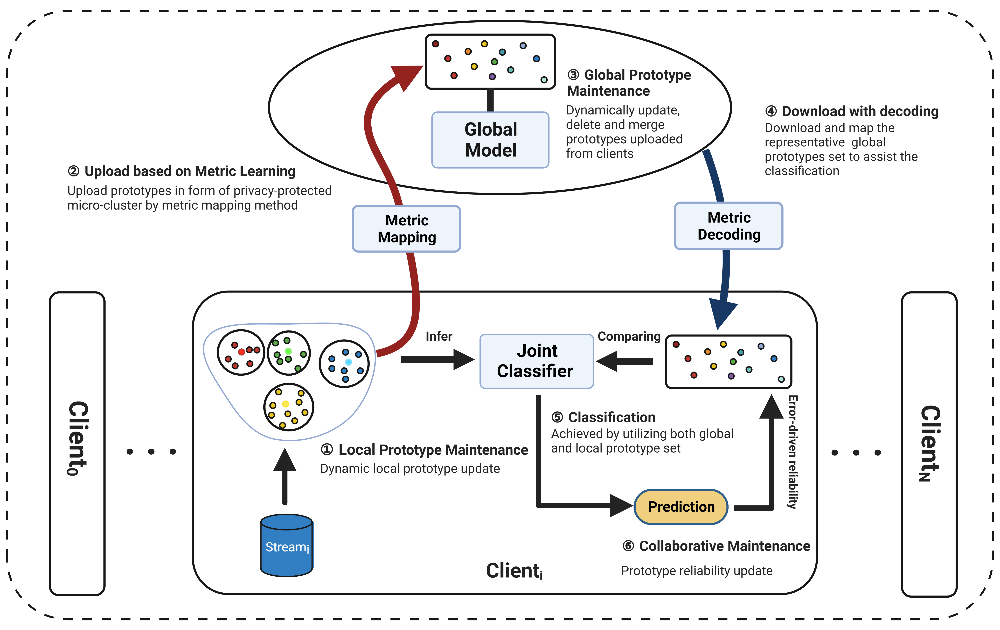

# FedStream: Prototype-Based Federated Learning on Distributed Concept-drifting Data Streams
Cobbinah B. Mawuli et al. 

Published in  IEEE Transactions on Systems, Man, and Cybernetics: Systems
[[`Paper`](https://ieeexplore.ieee.org/abstract/document/10198520)] [[`Dataset 1`](https://moa.cms.waikato.ac.nz/datasets/)] [[`Dataset 2`](https://archive.ics.uci.edu/datasets)] 

Detail code implementation and experimental setting for FedStream. For details, see the paper: FedStream: Prototype-Based Federated Learning on Distributed Concept-drifting Data Streams

Distributed data stream mining has gained increasing attention in recent years since many organizations collect tremendous amounts of streaming data from different locations. Existing studies mainly focus on learning evolving concepts on distributed data streams, while the privacy issue is little investigated. In this paper, for the first time, we develop a federated learning framework for distributed concept-drifting data streams, called FedStream. The proposed method allows capturing the evolving concepts by dynamically maintaining a set of prototypes with error-driven  representative learning. Meanwhile, a new metric-learning-based prototype transformation technique is introduced to preserve privacy among participating clients in the distributed data streams setting. Extensive experiments on both real-world and synthetic data sets have demonstrated the superiority of FedStream, and it even achieves competitive performance with state-of-the-art distributed learning methods.



## Usage
Install python dependencies.
```shell
conda create --name fedstream python=3.8 -y
conda activate fedstream

pip install -r requirement.txt
```

Code configuration.
```
parser = argparse.ArgumentParser()
    parser.add_argument('--dataset', type=str, default='covtype', help="name of dataset")
    parser.add_argument('--clients', type=int, default=10, help='Number of clients')
    parser.add_argument('--max_mc', type=int, default=200, help='max client micro-cluster')
    parser.add_argument('--global_mc', type=int, default=1000, help='max global micro-cluster')
    parser.add_argument('--features', type=int, default=54, help='Number of dataset features')
    parser.add_argument('--decay_rate', type=float, default=0.00002, help='Decay rate')
    parser.add_argument('--weight_const', type=float, default=0.6, help='Weight threshold constant')
    parser.add_argument('--local_init', type=int, default=50, help='Local initial cluster for single train')
    parser.add_argument('--global_init', type=int, default=50, help='global initial cluster for fed train')
    parser.add_argument('--reporting_interval', type=int, default=1000, help='global initial cluster for fed train')
    parser.add_argument('--initial_stream_size', type=int, default=1000, help='initial data instance size')
    parser.add_argument('--client_initial_size', type=int, default=500, help='initial data instance size for clients')
    parser.add_argument('--percent_init', type=float, default=0.1, help='set initial cluster number with percentage')
    parser.add_argument('--enable_fed_privacy', type=str2bool, default=False, const=True, nargs='?', help='Enable privacy for training')
    parser.add_argument('--run_type', choices=['FedStream', 'SingleStream', 'ClientsStream'], default='FedStream', help='experiment')
    args = parser.parse_args()
```

### Run
The provided `fdstream.py` can be run on  any computer provided the python dependencies  are statisfied. Example datasets can be found in the dataset folder. Follow the paper to configure 
other parameter values for exploration. 
```
python fdstream.py --dataset covtype --features 54
```

## Contributing

See [contributing](CONTRIBUTING.md).

## Contributors

The FedStream Algorithm was made possible with the help of many contributors:

 Liwei Che, Jay Kumar, Salah Ud Din, and Zhili Qin

# Citing FedStream
If you find FedStream useful, please consider giving a star ⭐ and citation
```
@article{mawuli2023fedstream,
  title={FedStream: Prototype-Based Federated Learning on Distributed Concept-Drifting Data Streams},
  author={Mawuli, Cobbinah B and Che, Liwei and Kumar, Jay and Din, Salah Ud and Qin, Zhili and Yang, Qinli and Shao, Junming},
  journal={IEEE Transactions on Systems, Man, and Cybernetics: Systems},
  year={2023},
  publisher={IEEE}
}
```
